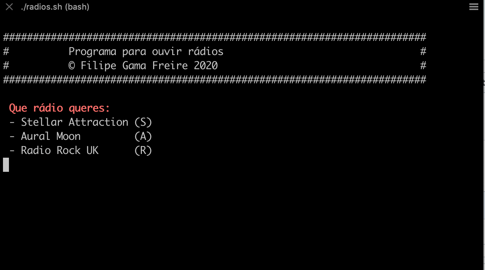

# radios
Ouvir os meus rádios preferidos

Foi feito para macos com mpv instalado (brew install mpv).

Não esquecer fazer chmod +x radios.sh

Para correr basta ./radios.sh

e seleccionar (A, S, ou R) conforme rádio que quer oiuvir.
